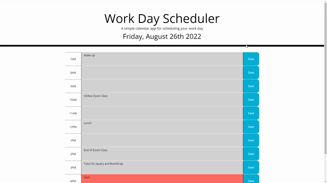

# Work Day Scheduler Starter Code

This work day scheduler has been created by three components of code using HTML, CSS, and JavaScript. User can plan out their schedule for the day.
The timing is represented by past, present, and future in color coordination so user can clearly see if the time of their scheduled event/reminder has passed.
The description of what their schedule is will be saved into the local storage once user puts an input into the description and clicks the save button.

## Installation
Make your way and follow the link below. User can then clone the repo using HTTP or SSH key. 
Once repo is cloned, user has full access to the HTML, CSS, and JS files.

Github: https://github.com/jonathan-lee8/event-calendar

## Usage

User can plan their schedule dependent on what day it is which is shown on the top of the page so they can plan accordingly. User can fill a description of what they want to input and save it down to the local storage so that even if the page or site is closed, the event description will still be shown. User can now schedule out the rest of their working hours.

## Credit

N/A

## License

MIT License

